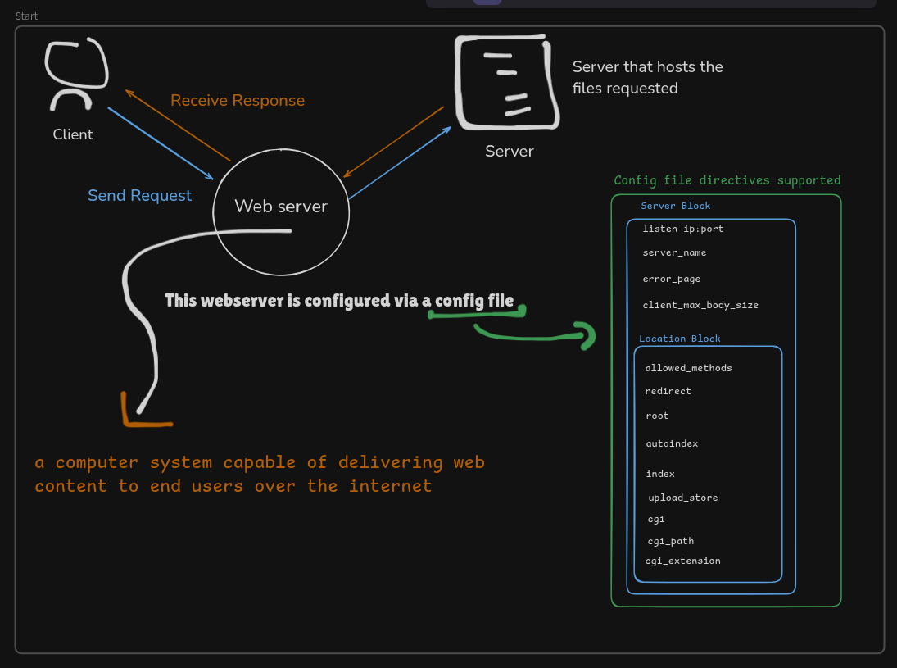
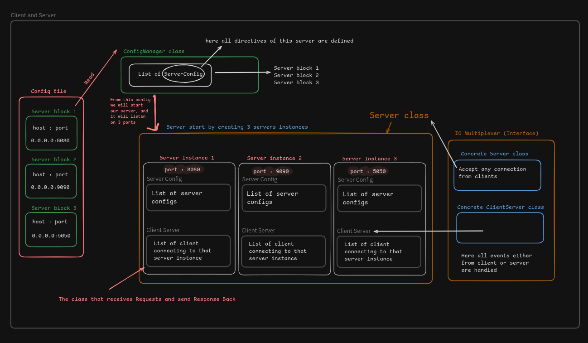
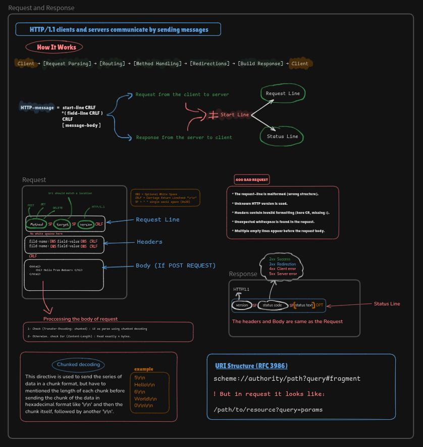

# 
 Webserv 

# Parts of webserv

## Team Member 1: Core Server and Configuration (nmellal)
- Core HTTP Server:
	- Implement server setup (socket creation, binding, listening).
	- Use poll() (or equivalent) for non-blocking I/O with read/write handling.
	- Ensure the server handles multiple clients simultaneously without blocking.
	- Implement proper connection termination (timeouts, errors).

- Configuration File Parsing:
	- Parse the configuration file for server details (port, host, routes).
	- Use default configuration if no file is provided.

- Error Handling:
	- Provide default error pages and send appropriate HTTP error codes (e.g., 404, 403).

## Team Member 2: Request Handling and Routing (abel-mqa)
- Request Parsing:
	- Handle incoming HTTP requests (GET, POST, DELETE).
	- Parse HTTP headers, body, and methods while handling chunked requests.
- Routing:
	- Map URLs to files or directories based on configuration rules.
	- Implement directory listing and default file serving.
- Method-Specific Features:
	- GET: Serve files or directories.
	- POST: Handle file uploads and enforce client body size limits.
	- DELETE: Remove specified files or directories (if allowed).
	- Support HTTP redirections where configured.

## Team Member 3: Advanced Features and Integration (mchihab)
- CGI Handling:
	- Integrate CGI for dynamic content generation (e.g., PHP, Python).
	- Handle input (chunked or regular) and output (content length or EOF).
- File Uploads:
	- Implement file upload functionality and configure save locations via the configuration file.
- Bonus Features:
	- Add support for cookies and session management.
	- Integrate multiple CGI handlers.

# Some Illustrations

